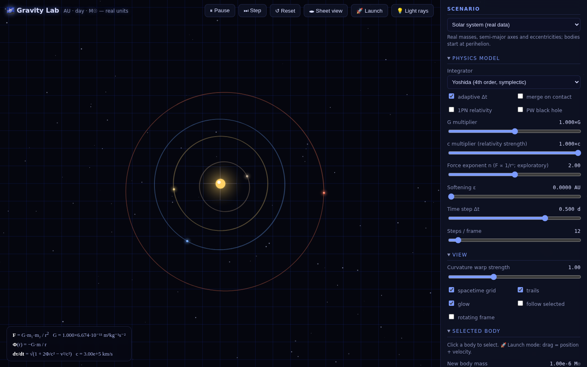
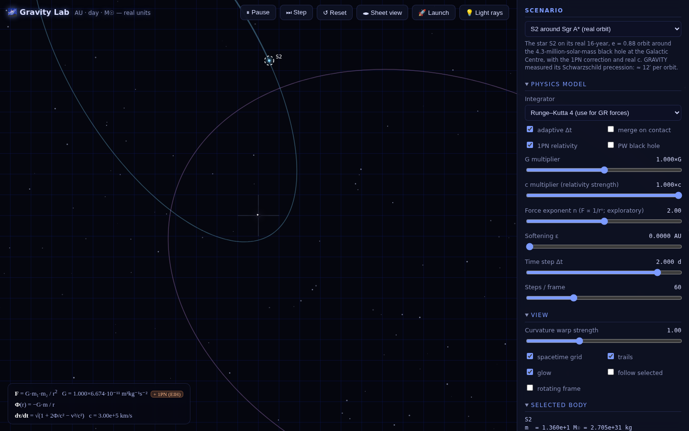
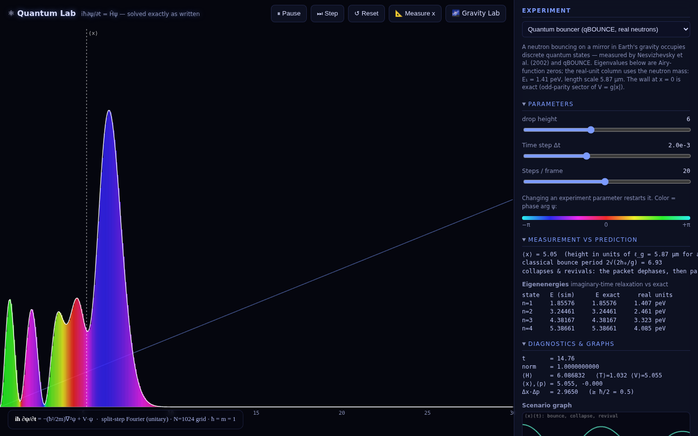
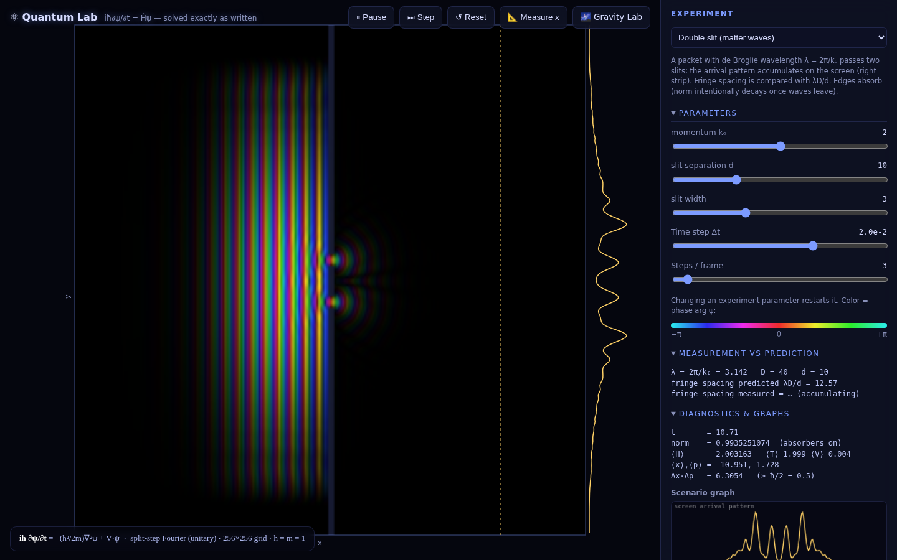

# 🌌 Gravity Lab + ⚛ Quantum Lab — physics instruments

Two interactive laboratories that make *testable predictions* — and test them,
live, against analytic physics and real experiments. Zero dependencies, pure
HTML/CSS/JS, runs entirely offline.

- **Gravity Lab** (`index.html`) — N-body dynamics in real units (AU · day ·
  M☉) with post-Newtonian general relativity.
- **Quantum Lab** (`quantum.html`) — the time-dependent Schrödinger equation,
  solved by the split-step Fourier method (exactly unitary), with experiments
  anchored to real measured results.




## Install & run

There is **nothing to install and no build step** — the app is plain
HTML/CSS/JS with zero dependencies and runs entirely offline. You only need the
files in this repo and a modern browser (Chrome, Firefox, Safari, or Edge).

**1. Get the files**

```sh
git clone <this-repo-url>
cd gravity
```

(Or just download the folder — there is no package to fetch.)

**2. Open the app** — pick whichever is easiest:

- **Simplest:** double-click `index.html` (Gravity Lab) or `quantum.html`
  (Quantum Lab) to open it directly in your browser. Use the 🌌 / ⚛ buttons in
  the top toolbar to switch between the two labs.

- **Recommended:** serve the folder over a local web server. This avoids
  browser `file://` restrictions and behaves exactly like a deployed site.
  Use any one of these from inside the project folder:

  ```sh
  python3 -m http.server 8000      # Python (preinstalled on macOS/Linux)
  # or
  npx serve .                      # Node.js
  # or
  php -S localhost:8000            # PHP
  ```

  Then open <http://localhost:8000/> for Gravity Lab, or
  <http://localhost:8000/quantum.html> for Quantum Lab.

No GPU, network, or special hardware is required; everything runs on the CPU in
a single browser tab.

### Running the validation suites (optional)

The physics test suites need **Node.js 16+** (only to run the simulation code
headlessly outside a browser — the app itself never needs Node). From the
project folder:

```sh
node test/run.js        # Gravity Lab: 23 checks vs analytic GR & celestial mechanics
node test/qm-run.js     # Quantum Lab: 16 checks vs analytic quantum mechanics
```

Each prints a `PASS`/`FAIL` line per check and exits non-zero if anything fails.

## The physics

Everything is integrated in astronomical units where G is the square of the
Gauss gravitational constant, so real ephemeris-style numbers come out:

| Model | Equation |
|---|---|
| Newtonian gravity | F = G·m₁·m₂ / rⁿ (n editable; Plummer softening ε optional) |
| 1PN relativity | pairwise EIH equations of motion (Will's standard form) |
| Black hole | Paczyński–Wiita Φ = −GM/(r−rₛ) — exact Schwarzschild ISCO at 6GM/c² |
| Light rays | null test rays, weak-field deflection (GR factor 2), captured inside 1.5rₛ |
| Time dilation | dτ/dt = √(1 + 2Φ/c² − v²/c²) |

**Integrators:** symplectic Euler (1st), velocity Verlet (2nd, symplectic),
Yoshida (4th, symplectic), classical RK4 (for velocity-dependent GR forces) —
selectable live, with adaptive substepping on close encounters.

**Measurements the instrument makes from its own data:**

- **Perihelion precession** — perihelion passages are detected with sub-step
  parabolic interpolation; the measured Δϖ per orbit is displayed next to the
  analytic 1PN prediction 6πGM/(c²a(1−e²)).
- **Empirical Kepler test** — orbital periods are measured by angle accumulation
  and plotted as T vs a (log–log) against the T = 2π√(a³/GM) line.
- **Conservation tracking** — relative drift of energy, angular momentum and
  linear momentum on a log scale, live. Switch integrators and watch the
  4th-order symplectic line drop by five decades.
- **Osculating elements** — a, e, T, speed, clock rate for any selected body.

## Scenarios

| Scenario | What it demonstrates |
|---|---|
| Solar system | Real masses, a, e for all 8 planets, started at perihelion |
| Mercury precession | 1PN advance vs the analytic prediction (c scaled ×0.02 to make ×2500 the real 0.104″/orbit visible; set c×1 for reality) |
| S2 around Sgr A* | The real 16-yr, e = 0.88 orbit at the Galactic Centre with real c — its ≈12′/orbit Schwarzschild precession is the effect GRAVITY measured in 2020 |
| Black hole ISCO | Paczyński–Wiita orbits: stable at 8GM/c², plunging inside 6GM/c², capture at 2rₛ |
| Sun–Jupiter Trojans | L1–L5 computed by root-finding; rotating-frame view shows tadpole libration |
| Binary + planet | Circumbinary dynamics |
| Three-body figure-8 | Chenciner–Montgomery choreography, solar masses at AU scale |
| Planetesimal accretion | Seeded RNG (reproducible), momentum-conserving merges |

## Views & tools

- **Top view** — spacetime grid pulled toward masses, heat-colored by potential.
- **Sheet view** — 3D embedding of Φ(x,y); drag to orbit the camera. Trails
  store the potential at the moment they were laid down and ride the sheet.
- **Rotating frame** — co-rotating frame of the two heaviest bodies; grid shows
  the effective potential Φ − ½ω²ρ², Lagrange points marked L1–L5. Launching a
  body in this view automatically adds the co-rotation velocity, so you can
  park a probe at L4 by just clicking there.
- **💡 Light rays** — emit a fan of null rays across the view; paths persist as
  fading ghosts. Around the black hole you get visible lensing and capture.
- **🚀 Launch mode** — drag = position + velocity (shown in km/s).
- **Body editor** — type exact m, x, y, vx, vy for any selected body.
- **Data** — CSV export of recorded trajectories, JSON save/load of exact state.

## Validation

`test/run.js` checks the shipped code against analytic results — among them:

- Mercury's 1PN perihelion precession matches 6πGM/(c²a(1−e²)) to < 3%
  (and vanishes with relativity off)
- photon deflection matches 4GM/(c²b) to < 5%
- PW circular orbits: stable at 8GM/c², unstable at 5.2GM/c² (ISCO at 6)
- L1 at one Hill radius, L4 equilateral, probe parked at L4 librates
- figure-8 choreography returns to its start after one analytic period
- Yoshida-4 energy error ≪ Verlet at equal Δt; ΔL/L ~ 10⁻¹⁵
- Earth's clock runs slow by ≈ 1.5×10⁻⁸, measured periods obey Kepler to < 1%

## Things to try

- Load **Mercury precession**, watch Δϖ measured converge to Δϖ predicted in
  the Selected-body panel, then set the c multiplier to 1 and see the real
  0.10″/orbit prediction appear.
- Load **Trojans**, enable 🚀 Launch, click exactly on L4 — the probe stays,
  librating. Click slightly off — tadpole orbit.
- Load **ISCO**, press 💡 — photon paths bend around the hole; the innermost
  rays spiral in and vanish.
- Set force exponent **n = 2.1** in the solar system: orbits precess (Bertrand's
  theorem) and the Kepler plot walks off the 3/2 line.

---

# ⚛ Quantum Lab




The state is a complex wavefunction ψ(x[,y],t), evolved by

```
iħ ∂ψ/∂t = [ −ħ²/2m ∇² + V ] ψ
```

with the **split-step Fourier method** — spectrally accurate and exactly
unitary, so the norm is conserved to ~10⁻¹⁴ and the panel proves it live.
Color is the quantum phase arg ψ; height/brightness is |ψ|². Live diagnostics:
norm and ⟨H⟩ drift, and the Heisenberg product Δx·Δp plotted against ħ/2.
Eigenstates are found by imaginary-time relaxation. A 📐 **Measure x** button
performs a projective position measurement (samples |ψ|², collapses the packet).

## Experiments — each anchored to something real

| Experiment | Reality anchor |
|---|---|
| Quantum bouncer | Nesvizhevsky 2002 / qBOUNCE: neutrons bouncing on a mirror in Earth's gravity have discrete Airy-function levels — the app reproduces E₁ = 1.407 peV, ℓ_g = 5.87 µm |
| Atom-interferometer gravimeter | The COW experiment (1975) and Kasevich–Chu interferometers: gravitational quantum phase Δφ = mgΔh·t/ħ — the app infers g from the measured fringe rate |
| Double slit | Matter-wave interference (Tonomura's electrons): measured first-minima fringe spacing vs λD/d |
| Tunneling | Transmission vs the analytic ∫\|φ(k)\|²T(k)dk for the discretized barrier |
| Harmonic oscillator | Coherent states: classical period, no spreading, Eₙ = (n+½)ħω |
| Free packet | Dispersion σ(t) = σ₀√(1+(ħt/2mσ₀²)²) overlaid live |
| Ehrenfest orbit | Gravity Lab's orbit, quantized: ⟨x⟩ tracks the classical RK4 path until the packet delocalizes |
| Two-particle collision | Configuration-space ψ(x₁,x₂): a 50/50 collision (E_rel = V₀) produces exactly K = 2 Schmidt modes — entanglement, live |

The two-particle panel is also the honest wall: n particles need grid^n
amplitudes — Feynman's 1981 argument for building quantum computers.

## Validation (`node test/qm-run.js`)

- norm conserved to 10⁻¹³ over 5000 steps; FFT round-trip at machine precision
- bouncer eigenvalues match Airy zeros to 4 decimals (E₁ ↔ 1.41 peV)
- gravimeter phase rate = mgΔh/ħ within 0.4%; tunneling T within 2%;
  fringes within 5%
- coherent state revives with overlap 1.000000 after exactly 2π/ω
- Ehrenfest exact for quadratic potentials (returns to start to 10⁻³)
- product state K = 1.000; 50/50 collision K = 2.009; no interaction ⇒ K stays 1
