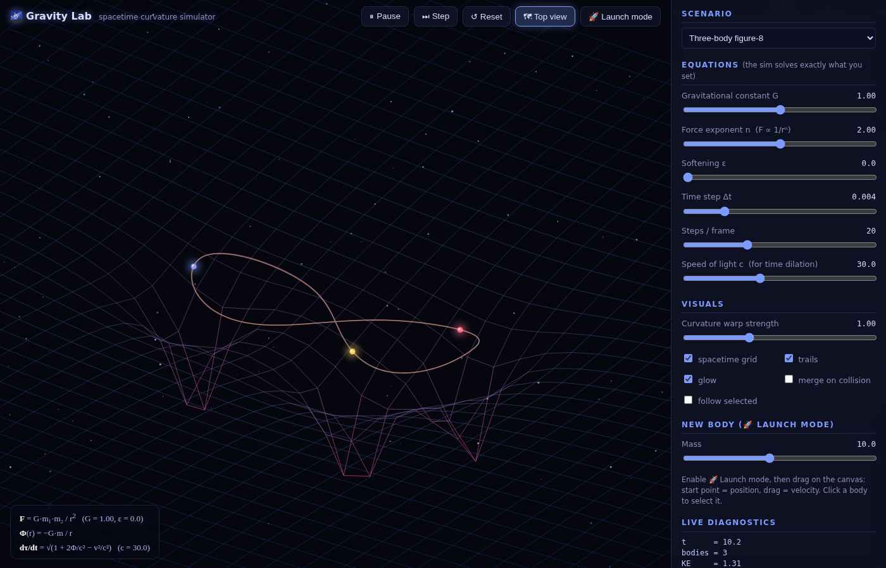

# 🌌 Gravity Lab — Spacetime Curvature Simulator

An interactive N-body gravity simulator that visualizes the curvature of space
and time — with every visual driven directly by the equations you set.
Zero dependencies, pure HTML/CSS/JS, runs entirely offline.




## Run it

Just open `index.html` in any modern browser, or serve the folder:

```sh
python3 -m http.server 8000
# → http://localhost:8000
```

## What it does

**Exact physics.** Bodies are integrated with velocity-Verlet (a symplectic
integrator, so energy stays conserved — watch the drift readout sit near
0.0001 %). The force law is fully editable:

```
F = G·m₁·m₂ / rₛⁿ          rₛ = √(r² + ε²)   (Plummer softening)
Φ(r) = −G·m / ((n−1)·rₛⁿ⁻¹)                  (log potential at n = 1)
dτ/dt = √(1 + 2Φ/c² − v²/c²)                 (weak-field time dilation)
```

The equation bar at the bottom-left always shows exactly what is being solved.
Change G, the force exponent n, the softening ε, or the speed of light c and
both the dynamics and the curvature visuals respond instantly.

**Curvature of space.** Two views, toggled with one button:

- **Top view** — the spacetime grid is pulled toward the masses, heat-colored
  by the depth of the local potential well.
- **Sheet view** — the classic 3D "rubber sheet" embedding: the grid is
  displaced by Φ(x, y) and you can orbit the camera around it by dragging.
  Trails record the potential at the moment they were laid down, so orbits
  visibly ride the curved sheet.

**Curvature of time.** Select any body to see its live clock rate dτ/dt, and
the curvature-profile graph plots both Φ(x) and the gravitational time-dilation
factor along a slice through the system. Lower c to exaggerate the effect.

**Live graphs.** Kinetic, potential and total energy over time, plus the
potential-well / clock-rate cross-section, updated every frame.

## Scenarios

| Preset | What you'll see |
|---|---|
| Planet orbiting a star | A clean Keplerian system to start with |
| Binary stars | Two suns waltzing around their barycenter |
| Three-body figure-8 | The Chenciner–Montgomery choreography (exact ICs) |
| Mini solar system | Five planets on circular orbits |
| Black-hole slingshot | Probes whipping around a dark 4000-mass well |
| Random chaos | 12 bodies, optionally merging on collision |
| Empty space | Build your own system from scratch |

## Controls

- **Wheel** — zoom (about the cursor in top view)
- **Drag** — pan (top view) / orbit the camera (sheet view)
- **Click a body** — select it (shows mass, speed, clock rate; enable
  *follow selected* to track it)
- **🚀 Launch mode** — drag on the canvas to fire a new body: start point is
  the position, the drag vector is the velocity
- **Space** — pause / resume · **⏭ Step** — single frame while paused

## Things to try

- Set the force exponent **n to 3** and watch orbits become unstable —
  Bertrand's theorem in action (only n = 2 and n = −1 give closed orbits).
- Lower **c** until the clock-rate curve dips toward 0 near a heavy mass —
  you've made its surface relativistic.
- Turn on **merge on collision** in the chaos preset and watch a planetary
  system accrete.
- Crank **G** mid-flight and watch the sheet deepen and orbits tighten.
